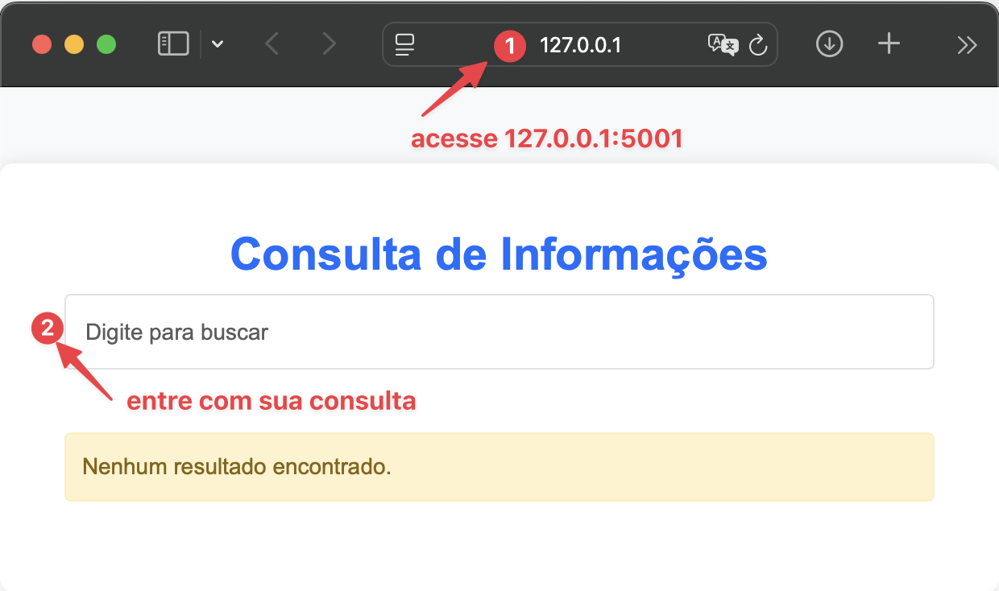

# 📝 Índice

- [1. Teste de Web Scraping](#1-teste-de-web-scraping)
- [2. Teste de Transformação de Dados](#2-teste-de-transformação-de-dados)
- [3. Teste de Banco de Dados](#3-teste-de-banco-de-dados)
- [4. Teste de API](#4-teste-de-api)


## 1. Teste de Web Scraping

O objetivo deste teste é realizar a extração de documentos a partir de uma página WEB e compactá-los.

### 📋 Pré-requisitos

Antes de começar, certifique-se de ter os seguintes requisitos instalados:

- Python 3.x
- Pip
- Google Chrome
- ChromeDriver

### 📦 Instalação

1. Clone este repositório:
   ```sh
   git clone https://github.com/guilhermekameoka/teste-de-nivelamento.git
   cd teste-de-nivelamento
   ```

2. Instale as dependências:
   ```sh
   pip install -r requirements.txt
   ```

### 🔧 Configuração

Antes de executar o projeto, é necessário configurar o diretório de download e a URL da página a ser extraída. Para isso, edite o arquivo `.env` na raiz do projeto e defina os seguintes parâmetros:

- **DOWNLOAD_DIR**: Caminho completo para o diretório onde os arquivos baixados serão armazenados.
- **URL**: URL do website que será extraído.

Certifique-se de que ambos os parâmetros estejam configurados corretamente para garantir que o processo de scraping funcione sem problemas.

### 🚀 Como executar

Para iniciar o processo de scraping e download:

```sh
# Para Windows
python3 webscrap/webscrapper.py
```

```sh
# Para Mac/Linux
python webscrap/webscrapper.py
```

Após a execução, os arquivos baixados serão compactados no arquivo `anexos.zip`.

### 🛠 Tecnologias utilizadas

- Python
- Selenium
- BeautifulSoup
- Requests
- WebDriver Manager


## 2. Teste de Transformação de Dados

O objetivo deste teste é realizar a extração de dados de uma tabela presente em um arquivo PDF e salvar esses dados em um arquivo CSV compactado em ZIP.

### 📋 Pré-requisitos

Antes de começar, certifique-se de ter os seguintes requisitos instalados:

- Python 3.x

### 🔧 Configuração

Antes de executar o script, é necessário configurar as variáveis de ambiente. Edite o arquivo `.env` na pasta raiz do projeto e adicione o caminho para o arquivo PDF a ser processado. As variáveis de ambiente necessárias são:

- **PDF_PATH**: Caminho do arquivo PDF de entrada.

### 🚀 Como executar

Para iniciar o processo de transformação de dados:

```sh
# Para Windows
python3 -m data_extraction.transformData
```

```sh
# Para Mac/Linux
python -m data_extraction.transformData
```

Após a execução, o arquivo CSV será compactado em um arquivo ZIP com o nome `Teste_Guilherme_Kameoka.zip`.

### 🛠 Tecnologias utilizadas

- Python
- pdfplumber
- pandas
- zipfile
- dotenv

## 3. Teste de Banco de Dados

### 1. Query para estruturar a tabela

```sql
CREATE TABLE health_expenses (
    data DATE NOT NULL,
    reg_ans VARCHAR(20) NOT NULL,
    cd_conta_contabil VARCHAR(20) NOT NULL,
    descricao VARCHAR(255),
    vl_saldo_inicial DECIMAL(15,2),
    vl_saldo_final DECIMAL(15,2)
);
```

### 2. Queries para importar o conteúdo dos arquivos preparados
```sql
   -- Importa os dados do 1º Trimestre de 2023
LOAD DATA INFILE '/Users/guilhermekameoka/Desktop/prova/database/financial_statements/2023/1T2023.csv'
INTO TABLE health_expenses
CHARACTER SET utf8
FIELDS TERMINATED BY ';'
ENCLOSED BY '"'
LINES TERMINATED BY '\r\n'
IGNORE 1 LINES
(@data, @reg_ans, @cd_conta_contabil, @descricao, @vl_saldo_inicial, @vl_saldo_final)
SET
   data = STR_TO_DATE(@data, '%Y-%m-%d'),
   reg_ans = TRIM(@reg_ans),
   cd_conta_contabil = TRIM(@cd_conta_contabil),
   descricao = TRIM(@descricao),
   vl_saldo_inicial = CAST(REPLACE(@vl_saldo_inicial, ',', '.') AS DECIMAL(15,2)),
   vl_saldo_final = CAST(REPLACE(@vl_saldo_final, ',', '.') AS DECIMAL(15,2));

-- Importa os dados do 2º Trimestre de 2023
LOAD DATA INFILE '/Users/guilhermekameoka/Desktop/prova/database/financial_statements/2023/2T2023.csv'
INTO TABLE health_expenses
CHARACTER SET utf8
FIELDS TERMINATED BY ';'
ENCLOSED BY '"'
LINES TERMINATED BY '\r\n'
IGNORE 1 LINES
(@data, @reg_ans, @cd_conta_contabil, @descricao, @vl_saldo_inicial, @vl_saldo_final)
SET
   data = STR_TO_DATE(@data, '%Y-%m-%d'),
   reg_ans = @reg_ans,
   cd_conta_contabil = @cd_conta_contabil,
   descricao = @descricao,
   vl_saldo_inicial = REPLACE(@vl_saldo_inicial, ',', '.'),
   vl_saldo_final = REPLACE(@vl_saldo_final, ',', '.');

-- Importa os dados do 3º Trimestre de 2023
LOAD DATA INFILE '/Users/guilhermekameoka/Desktop/prova/database/financial_statements/2023/3T2023.csv'
INTO TABLE health_expenses
CHARACTER SET utf8
FIELDS TERMINATED BY ';'
ENCLOSED BY '"'
LINES TERMINATED BY '\r\n'
IGNORE 1 LINES
(@data, @reg_ans, @cd_conta_contabil, @descricao, @vl_saldo_inicial, @vl_saldo_final)
SET
   data = STR_TO_DATE(@data, '%Y-%m-%d'),
   reg_ans = @reg_ans,
   cd_conta_contabil = @cd_conta_contabil,
   descricao = @descricao,
   vl_saldo_inicial = REPLACE(@vl_saldo_inicial, ',', '.'),
   vl_saldo_final = REPLACE(@vl_saldo_final, ',', '.');
   vl_saldo_final = REPLACE(@vl_saldo_final, ',', '.');

-- Importa os dados do 4º Trimestre de 2023
LOAD DATA INFILE '/Users/guilhermekameoka/Desktop/prova/database/financial_statements/2023/4T2023.csv'
INTO TABLE health_expenses
CHARACTER SET utf8
FIELDS TERMINATED BY ';'
ENCLOSED BY '"'
LINES TERMINATED BY '\r\n'
IGNORE 1 LINES
(@data, @reg_ans, @cd_conta_contabil, @descricao, @vl_saldo_inicial, @vl_saldo_final)
SET
   data = STR_TO_DATE(@data, '%d/%m/%Y'), -- Datas no csv estão no formato d/m/y
   reg_ans = @reg_ans,
   cd_conta_contabil = @cd_conta_contabil,
   descricao = @descricao,
   vl_saldo_inicial = REPLACE(@vl_saldo_inicial, ',', '.'),
   vl_saldo_final = REPLACE(@vl_saldo_final, ',', '.');

-- Importa os dados do 1º Trimestre de 2024
LOAD DATA INFILE '/Users/guilhermekameoka/Desktop/prova/database/financial_statements/2024/1T2024.csv'
INTO TABLE health_expenses
CHARACTER SET utf8
FIELDS TERMINATED BY ';'
ENCLOSED BY '"'
LINES TERMINATED BY '\r\n'
IGNORE 1 LINES
(@data, @reg_ans, @cd_conta_contabil, @descricao, @vl_saldo_inicial, @vl_saldo_final)
SET
   data = STR_TO_DATE(@data, '%Y-%m-%d'),
   reg_ans = @reg_ans,
   cd_conta_contabil = @cd_conta_contabil,
   descricao = @descricao,
   vl_saldo_inicial = REPLACE(@vl_saldo_inicial, ',', '.'),
   vl_saldo_final = REPLACE(@vl_saldo_final, ',', '.');

-- Importa os dados do 2º Trimestre de 2024
LOAD DATA INFILE '/Users/guilhermekameoka/Desktop/prova/database/financial_statements/2024/2T2024.csv'
INTO TABLE health_expenses
CHARACTER SET utf8
FIELDS TERMINATED BY ';'
ENCLOSED BY '"'
LINES TERMINATED BY '\r\n'
IGNORE 1 LINES
(@data, @reg_ans, @cd_conta_contabil, @descricao, @vl_saldo_inicial, @vl_saldo_final)
SET
   data = STR_TO_DATE(@data, '%Y-%m-%d'),
   reg_ans = @reg_ans,
   cd_conta_contabil = @cd_conta_contabil,
   descricao = @descricao,
   vl_saldo_inicial = REPLACE(@vl_saldo_inicial, ',', '.'),
   vl_saldo_final = REPLACE(@vl_saldo_final, ',', '.');

-- Importa os dados do 3º Trimestre de 2024
LOAD DATA INFILE '/Users/guilhermekameoka/Desktop/prova/database/financial_statements/2024/3T2024.csv'
INTO TABLE health_expenses
CHARACTER SET utf8
FIELDS TERMINATED BY ';'
ENCLOSED BY '"'
LINES TERMINATED BY '\r\n'
IGNORE 1 LINES
(@data, @reg_ans, @cd_conta_contabil, @descricao, @vl_saldo_inicial, @vl_saldo_final)
SET
   data = STR_TO_DATE(@data, '%Y-%m-%d'),
   reg_ans = @reg_ans,
   cd_conta_contabil = @cd_conta_contabil,
   descricao = @descricao,
   vl_saldo_inicial = REPLACE(@vl_saldo_inicial, ',', '.'),
   vl_saldo_final = REPLACE(@vl_saldo_final, ',', '.');

-- Importa os dados do 4º Trimestre de 2024
LOAD DATA INFILE '/Users/guilhermekameoka/Desktop/prova/database/financial_statements/2024/4T2024.csv'
INTO TABLE health_expenses
CHARACTER SET utf8
FIELDS TERMINATED BY ';'
ENCLOSED BY '"'
LINES TERMINATED BY '\r\n'
IGNORE 1 LINES
(@data, @reg_ans, @cd_conta_contabil, @descricao, @vl_saldo_inicial, @vl_saldo_final)
SET
   data = STR_TO_DATE(@data, '%Y-%m-%d'),
   reg_ans = @reg_ans,
   cd_conta_contabil = @cd_conta_contabil,
   descricao = @descricao,
   vl_saldo_inicial = REPLACE(@vl_saldo_inicial, ',', '.'),
   vl_saldo_final = REPLACE(@vl_saldo_final, ',', '.');
```

### 3. Queries analíticas
   ```sql
   -- Quais as 10 operadoras com maiores despesas em "EVENTOS/ SINISTROS CONHECIDOS OU
-- AVISADOS DE ASSISTÊNCIA A SAÚDE MEDICO HOSPITALAR" no último trimestre?
SELECT reg_ans, 
       SUM(vl_saldo_final - vl_saldo_inicial) AS total_despesas
FROM health_expenses
WHERE descricao = "EVENTOS/SINISTROS CONHECIDOS OU AVISADOS DE ASSISTÊNCIA A SAÚDE MÉDICO HOSPITALAR"
  AND data BETWEEN '2024-07-01' AND '2024-09-30'  -- 3º trimestre de 2024
GROUP BY reg_ans
ORDER BY total_despesas DESC
LIMIT 10;
```
```sql
-- Quais as 10 operadoras com maiores despesas nessa categoria no último ano?
SELECT reg_ans, 
       SUM(vl_saldo_final - vl_saldo_inicial) AS total_despesas
FROM health_expenses
WHERE descricao = "EVENTOS/SINISTROS CONHECIDOS OU AVISADOS DE ASSISTÊNCIA A SAÚDE MÉDICO HOSPITALAR"
  AND YEAR(data) = 2024  -- ano de 2024
GROUP BY reg_ans
ORDER BY total_despesas DESC
LIMIT 10;
```

### 🛠 Tecnologias utilizadas
   - MySQL


## 4. Teste de API

O objetivo deste teste é permitir a consulta de informações de operadoras de saúde de um arquivo csv, utilizando Vue.js.

### 📋 Pré-requisitos

Antes de começar, certifique-se de ter os seguintes requisitos instalados:

- Python 3.x
- Vue.js
- Flask
- Axios

### 📦 Instalação

1. Clone este repositório:
   ```sh
   git clone https://github.com/guilhermekameoka/teste-de-nivelamento.git
   cd teste-de-nivelamento
   ```

2. Instale as dependências:
   ```sh
   pip install -r requirements.txt
   ```

### 🔧 Configuração

Antes de executar o projeto, é necessário configurar a variável de ambiente. Edite o arquivo `.env` e adicione o caminho para o arquivo CSV a ser processado. A variável de ambiente necessária é:

- **CSV_PATH**: Caminho do arquivo CSV de entrada.

### 🚀 Como executar

Para iniciar o serviço:

```sh
# Para Windows
python3 api/server.py
```

```sh
# Para Mac/Linux
python api/server.py
```

Em seguida abra seu navegador de preferência e siga os passaos abaixo:

1. No endereço URL, acesse [localhost:5001](127.0.0.1:5001)
2. Entre com sua consulta no campo de busca indicado



### 👨‍🚀 Postman


### 🛠 Tecnologias utilizadas

- Python
- Flask
- Vue.js
- Axios
- Bootstrap
- Postman