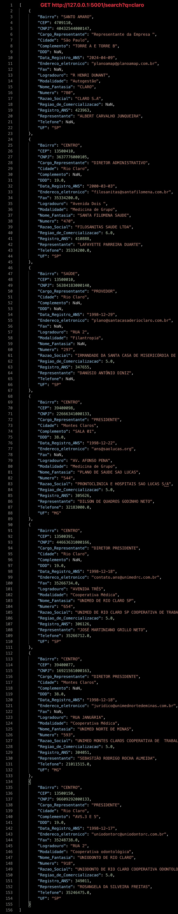
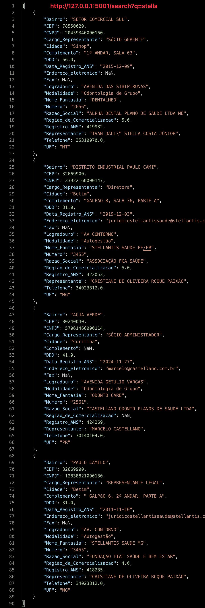
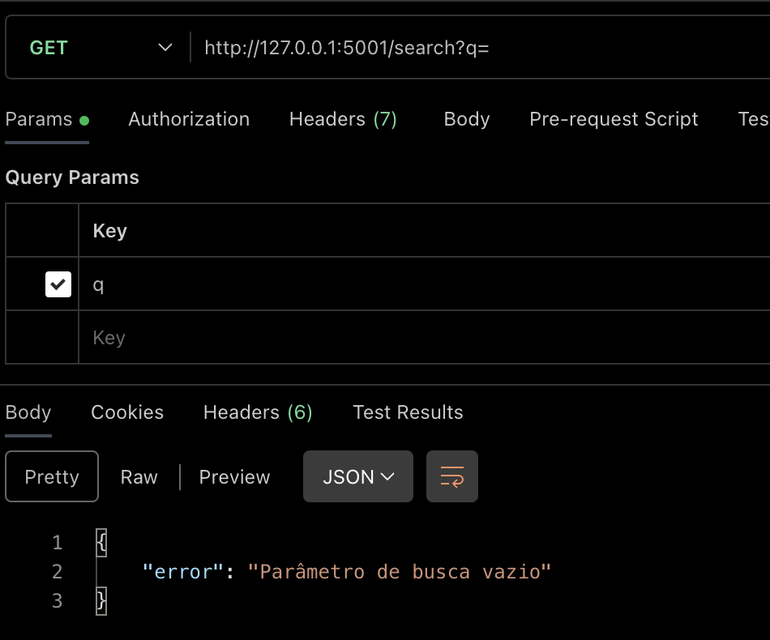

# 📝 Índice

- [1. Teste de Web Scraping](#1-teste-de-web-scraping)
- [2. Teste de Transformação de Dados](#2-teste-de-transformação-de-dados)
- [3. Teste de API](#3-teste-de-api)


## 1. Teste de Web Scraping

O objetivo deste teste é realizar a extração de documentos a partir de uma página WEB e compactá-los.

### 📋 Pré-requisitos

Antes de começar, certifique-se de ter os seguintes requisitos instalados:

- Python 3.x
- Pip
- Google Chrome
- ChromeDriver

### 📦 Instalação

1. Clone este repositório:
   ```sh
   git clone https://github.com/guilhermekameoka/teste-de-nivelamento.git
   cd teste-de-nivelamento
   ```

2. Instale as dependências:
   ```sh
   pip install -r requirements.txt
   ```

### 🔧 Configuração

Antes de executar o projeto, é necessário configurar o diretório de download e a URL da página a ser extraída. Para isso, edite o arquivo `.env` na raiz do projeto e defina os seguintes parâmetros:

- **DOWNLOAD_DIR**: Caminho completo para o diretório onde os arquivos baixados serão armazenados.
- **URL**: URL do website que será extraído.

Certifique-se de que ambos os parâmetros estejam configurados corretamente para garantir que o processo de scraping funcione sem problemas.

### 🚀 Como executar

Para iniciar o processo de scraping e download:

```sh
# Para Windows
python3 webscrap/webscrapper.py
```

```sh
# Para Mac/Linux
python webscrap/webscrapper.py
```

Após a execução, os arquivos baixados serão compactados no arquivo `anexos.zip`.

### 🛠 Tecnologias utilizadas

- Python
- Selenium
- BeautifulSoup
- Requests
- WebDriver Manager


## 2. Teste de Transformação de Dados

O objetivo deste teste é realizar a extração de dados de uma tabela presente em um arquivo PDF e salvar esses dados em um arquivo CSV compactado em ZIP.

### 📋 Pré-requisitos

Antes de começar, certifique-se de ter os seguintes requisitos instalados:

- Python 3.x

### 🔧 Configuração

Antes de executar o script, é necessário configurar as variáveis de ambiente. Edite o arquivo `.env` na pasta raiz do projeto e adicione o caminho para o arquivo PDF a ser processado. As variáveis de ambiente necessárias são:

- **PDF_PATH**: Caminho do arquivo PDF de entrada.

### 🚀 Como executar

Para iniciar o processo de transformação de dados:

```sh
# Para Windows
python3 -m data_extraction.transformData
```

```sh
# Para Mac/Linux
python -m data_extraction.transformData
```

Após a execução, o arquivo CSV será compactado em um arquivo ZIP com o nome `Teste_Guilherme_Kameoka.zip`.

### 🛠 Tecnologias utilizadas

- Python
- pdfplumber
- pandas
- zipfile
- dotenv


## 3. Teste de API

O objetivo deste teste é permitir a consulta de informações de operadoras de saúde utilizando Vue.js.

### 📋 Pré-requisitos

Antes de começar, certifique-se de ter os seguintes requisitos instalados:

- Python 3.x
- Vue.js
- Flask
- Axios

### 📦 Instalação

1. Clone este repositório:
   ```sh
   git clone https://github.com/guilhermekameoka/teste-de-nivelamento.git
   cd teste-de-nivelamento
   ```

2. Instale as dependências:
   ```sh
   pip install -r requirements.txt
   ```

### 🔧 Configuração

Antes de executar o projeto, é necessário configurar a variável de ambiente. Edite o arquivo `.env` e adicione o caminho para o arquivo CSV a ser processado. A variável de ambiente necessária é:

- **CSV_PATH**: Caminho do arquivo CSV de entrada.

### 🚀 Como executar

Para iniciar o serviço:

```sh
# Para Windows
python3 api/server.py
```

```sh
# Para Mac/Linux
python api/server.py
```

### 👨‍🚀 Postman





### 🛠 Tecnologias utilizadas

- Python
- Flask
- Vue.js
- Axios